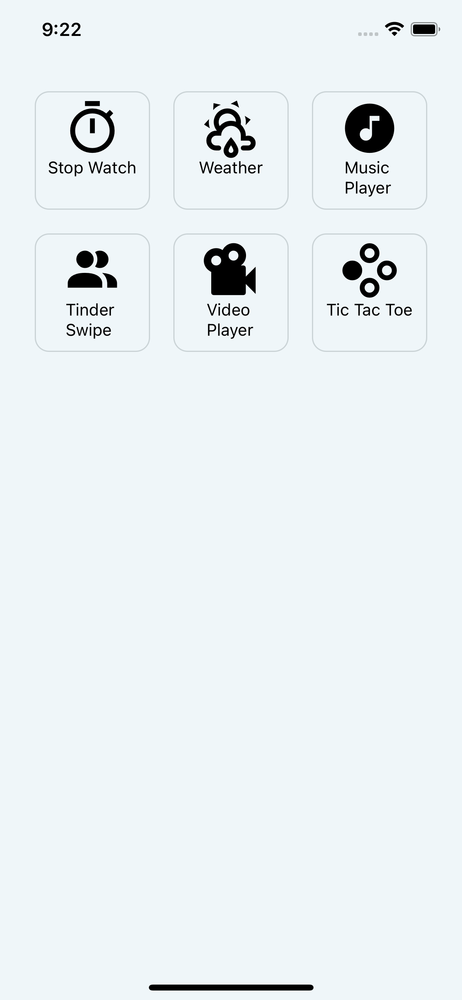

# 50-days-of-react-native

### Installation:

Please note that the setup instruction assumes that you have setup your development environment to run react native apps. If you haven't, see instructions [here](https://reactnative.dev/docs/environment-setup)

- download the repository as a zip file or clone it via `git clone https://github.com/Nnanyielugo/50-days-of-react-native.git`. If you use ssh, replace the url with `git@github.com:Nnanyielugo/50-days-of-react-native.git`
- navigate to the root folder of the project.
- create a `.env` file in the root folder and add `OPEN_WEATHER_API_KEY` and `GOOGLE_MAPS_API_KEY` from [open weather](https://openweathermap.org/api) and [google cloud console](https://developers.google.com/maps/documentation/javascript/get-api-key).
- make sure you enable Geocoding API, Maps SDK, and Places API on google maps API.
- run `npm install`
- run `npm run set-env && npm run android` to run the app. Please note that ios support is in progress.

### Demos

#### Menu

#### [Music Player](https://github.com/Nnanyielugo/50-days-of-react-native/blob/master/src/Containers/MusicPlayer/readme.md)

#### [StopWatch](https://github.com/Nnanyielugo/50-days-of-react-native/blob/master/src/Containers/StopWatch/readme.md)

#### [Weather](https://github.com/Nnanyielugo/50-days-of-react-native/blob/master/src/Containers/Weather/readme.md)

#### [Tinder Swipe](https://github.com/Nnanyielugo/50-days-of-react-native/blob/master/src/Containers/TinderSwipe/readme.md)

#### Video is unfinished

#### [TicTacToe](https://github.com/Nnanyielugo/50-days-of-react-native/blob/master/src/Containers/TicTacToe/readme.md)

### TODO

- [x] Upgrade to RN 0.64xx
- [x] integrate TS
- [x] refactor stopwatch
- [x] add basic navigation
- [ ] welcome pages
- [x] tinder swipe cards
- [x] add ios support
- [ ] notes (Samsung notes implementation)
- [x] weather app
- [x] music player
- [x] video player
- [ ] reels
- [ ] pdf reader
- [ ] core animation and masks (twitter entrance animation)
- [x] tic-tac-toe
- [ ] app menu
- [ ] custom swipe transitions
- [ ] segmented control views
- [ ] mapview and find geolocation
- [ ] pan gesture (move objects around, specify background, specify object, and toggle spring back (with animation))
- [ ] pattern unlock (with gesture)
- [ ] fuzzy search
- [ ] sortable blocks
- [ ] multi page reminder
- [ ] D3.js samples (Webview)
- [ ] scrollable tab (old youtube example?)
- [ ] imessage gradient
- [ ] push notification
- [ ] image carousel
- [ ] action sheet
- [ ] jumpbar
- [ ] pull to refresh
- [ ] calculator
- [ ] basic charts
- [ ] dynamic charts (with chart information)
- [ ] basic run tracker (hint: geolocation.watchPosition)
- [ ] mapview with directions
- [ ] animated chat heads
- [ ] google calendar
- [ ] run tracker
- [ ] currency converter
